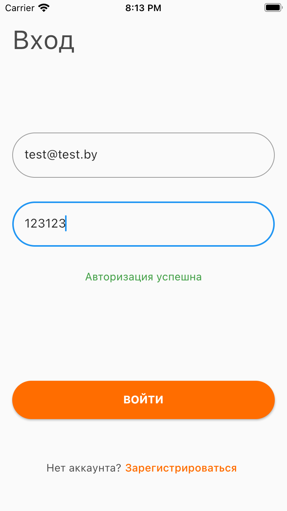
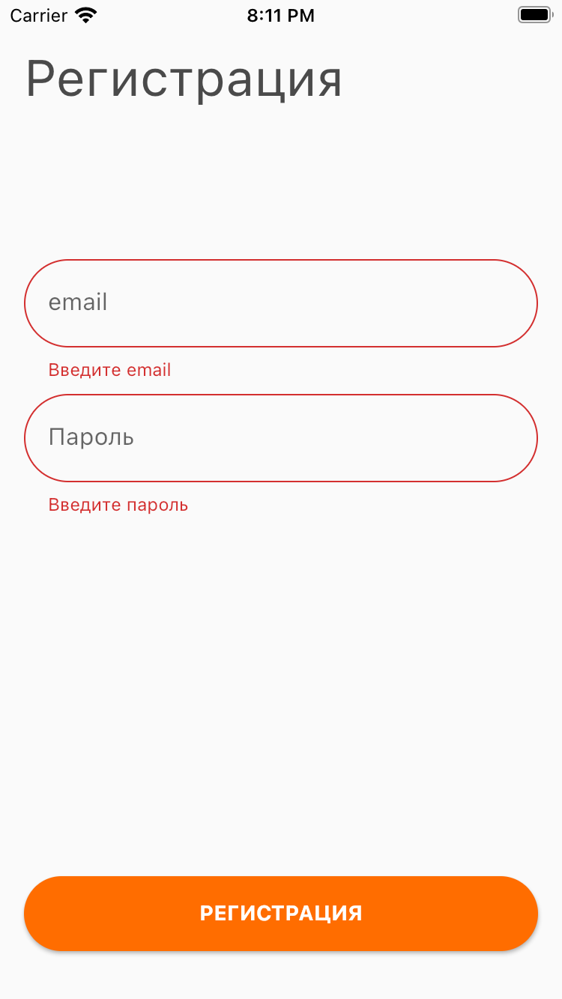

# flutter_testing
Изучаю тестирование: unit, widget и integration. На примере экрана авторизации

 

  
  

**Интеграционные тесты**

1. Запустить эмулятор
2. Перейти в test/integration/test_driver/app.dart
3. Выполнить Run для main()
4. Перейти в test/integration/test_driver/app_test.dart
5. Выполнить Run для main()

  
  

**Виджет тесты**

1. Перейти в test/widget/widget_test.dart
2. Выполнить Run для main()

**Unit**

1. Перейти в test/unit/validate_email_test.dart
2. Выполнить Run для main()